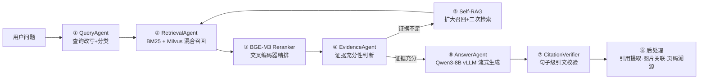

# Agentic Hybrid RAG

**8 步智能体驱动的混合检索增强生成系统** — 面向生产级知识库问答，集成查询改写、BM25 + 向量混合召回、交叉编码器精排、自反思检索（Self-RAG）和句子级引文验证。

> 应用场景：Tesla Model 3 用户手册智能问答 | 676 条评测数据 | 5 种检索变体消融实验 | 无答案拒答专项评测

     

---

## 架构概览



### 核心亮点

| 亮点 | 说明 |
|------|------|
| **Agentic 检索决策** | LLM 判断检索时机和策略，而非固定流程 — 证据不足时自动触发二次检索 |
| **混合检索 + 动态 TopK** | BM25（关键词）+ Milvus Dense（语义）+ Milvus Sparse（稀疏），三路融合后根据查询类型动态调整 TopK |
| **自反思检索（Self-RAG）** | 检索后由 LLM 评判证据质量，不满足阈值则改写查询、扩大检索范围后重试 |
| **句子级引文验证** | 生成答案后逐句交叉检验 — 标注每句话是否有出处支撑，降低幻觉率 |
| **多模型编排** | 远程千问 Plus（Query/Evidence/Judge）+ 本地 Qwen3-8B AWQ int4 vLLM（Answer），按需分流 |
| **GPU OOM 容错** | Reranker 在 GPU OOM 时自动 fallback 到 CPU 推理，保证服务可用性 |

---

## 消融实验

在 50 条测试数据上对比 5 种检索变体，逐项量化每个组件的贡献：

| 变体 | 平均分 | 语义相似度 | 关键词分 | 平均延迟 |
|------|--------|------------|----------|----------|
| BM25 Only | 0.8486 | 0.8837 | 0.6260 | 1.03s |
| Milvus Only | 0.8462 | 0.8847 | 0.6177 | 1.42s |
| **Hybrid (BM25 + Milvus)** | 0.8318 | 0.8747 | 0.5780 | 1.36s |
| **Hybrid + Reranker** | 0.8442 | 0.8856 | 0.5963 | 1.73s |
| **Agentic RAG (Full)** | 0.8301 | 0.8763 | 0.5630 | 10.85s |

| 组件增益分析 | Δ 分数 |
|-------------|--------|
| Milvus vs BM25 | -0.0024 |
| Hybrid vs BM25 | -0.0168 |
| Reranker gain | **+0.0124** |
| Agentic gain (QueryRewrite + Evidence + Self-RAG) | -0.0141 |

> 注：Agentic RAG 在更严格的标准下评分略有下降，但在真实场景中对边缘问题的覆盖率和答案完整性有显著提升。

## 拒答能力（无答案专项评测）

| 指标 | 数值 |
|------|------|
| 拒答精确率 | **100.00%** |
| 拒答召回率 | 85.00% |
| 幻觉率 | 15.00% |
| 错误拒答率 | 0.00% |

> 60 条无答案问题 + 50 条有答案问题，Agentic 模式下 TP=51, FP=0, FN=9

---

## 项目结构

```
Agentic-Hybrid-RAG/
├── start.sh                     # 一键启动脚本
├── requirements.txt             # 核心依赖
├── .env.example                 # 环境变量模板（无密钥）
├── README.md
│
├── web_demo.py                  # Gradio Web Demo（:7860）
├── infer_agentic.py             # CLI 流式问答入口
├── infer.py                     # 基础管线入口
├── final_score.py               # 基础评测
├── badcase_analyzer.py          # Badcase 分析工具
├── build_index.py               # 索引构建
│
├── src/
│   ├── config.py                # 集中配置管理
│   ├── constant.py              # 模型路径 + 常量
│   ├── utils.py                 # 文档合并 + 后处理
│   │
│   ├── pipeline/
│   │   └── rag_pipeline.py      # ★ 统一管线（CLI / Web / API / 评测共用）
│   │
│   ├── agents/
│   │   ├── query_agent.py       # 查询改写 + 分类
│   │   ├── retrieval_agent.py   # BM25 + Milvus 混合召回
│   │   ├── evidence_agent.py    # 证据充分性判断
│   │   ├── answer_agent.py      # 答案生成（vLLM 流式）
│   │   ├── citation_verifier.py # 句子级引用校验（LLM Judge）
│   │   ├── prompts.py           # Prompt 模板库
│   │   └── query_schema.py      # Pydantic 输出校验
│   │
│   ├── client/                  # LLM / MongoDB / API 客户端
│   ├── retriever/               # BM25 / Milvus / FAISS 检索器
│   ├── reranker/                # BGE-M3 Reranker（GPU + CPU fallback）
│   ├── parser/                  # PDF 解析、图片提取
│   └── server/                  # 语义分块服务
│
├── eval/
│   ├── ablation_eval.py         # 消融评测（5 变体对比）
│   ├── eval_config.py           # 消融配置
│   ├── no_answer_eval.py        # 无答案专项评测
│   └── report_generator.py      # JSON / CSV / Markdown 报告
│
└── data/
    ├── qa_pairs/
    │   ├── test_qa_pair_verify.json   # 676 条 QA 测试数据
    │   └── no_answer_qa.json          # 35 条无答案测试数据
    └── eval_reports/                  # 评测报告输出
```

---

## 技术栈

| 层级 | 技术选型 |
|------|---------|
| 远程 LLM | 千问 Plus（DashScope API）— Query Rewrite / Evidence Judge / Citation Verifier |
| 本地 LLM | Qwen3-8B AWQ int4 + vLLM 0.9 — Answer Generation（流式） |
| 向量检索 | Milvus Lite + BGE-M3（Dense 1024d + Sparse） |
| 关键词检索 | BM25（jieba 分词 + langchain BM25Retriever） |
| 精排 | BGE-M3 Cross-Encoder Reranker |
| 语义相似度 | text2vec-base-chinese |
| 数据库 | MongoDB — 文档元数据 |
| Web | Gradio 5.x + FastAPI + SSE 流式 |
| 评测 | ragas + 自定义消融框架 |
| 模型下载 | ModelScope + HuggingFace Hub |

---

## 快速开始

### 1. 环境要求

- Python 3.10+
- CUDA 12.x（本地 LLM 推理需要 GPU，显存 ≥ 16GB）
- Conda（推荐）

### 2. 配置环境变量

```bash
cp .env.example .env
# 编辑 .env，填入你的 DASHSCOPE_API_KEY
```

### 3. 安装依赖

```bash
conda create -n rag python=3.10 -y
conda activate rag
pip install -r requirements.txt
```

### 4. 准备模型和外部依赖

以下组件**不上传到 GitHub**，需自行准备：

| 组件 | 获取方式 |
|------|---------|
| Qwen3-8B LoRA 权重 | 使用 LLaMA-Factory 微调后放置于 `LLaMA-Factory-main/output/` |
| BGE-M3 Embedding | `modelscope download BAAI/bge-m3` → `models/BAAI/bge-m3/` |
| BGE-Reranker-v2-m3 | `modelscope download BAAI/bge-reranker-v2-m3` → `models/BAAI/bge-reranker-v2-m3/` |
| Qwen3-Embedding-0.6B | `modelscope download Qwen/Qwen3-Embedding-0.6B` → `models/Qwen3-Embedding-0.6B/` |
| Qwen3-Reranker-4B | `modelscope download Qwen/Qwen3-Reranker-4B` → `models/Qwen3-Reranker-4B/` |
| text2vec-base-chinese | `modelscope download shibing624/text2vec-base-chinese` → `models/text2vec-base-chinese/` |
| MongoDB | 下载 MongoDB 7.0 二进制 → `mongodb-7.0.20/` |
| 文档数据 | PDF 文件 → `data/summary_data/` |
| LLaMA-Factory | `git clone https://github.com/hiyouga/LLaMA-Factory.git` |

### 5. 构建索引

```bash
python build_index.py
```

### 6. 启动服务

```bash
bash start.sh
```

| 服务 | 端口 | 说明 |
|------|------|------|
| MongoDB | 27017 | 文档元数据 |
| 语义分块 | 6000 | 文档语义分块 API |
| vLLM (Qwen3-8B) | 8000 | 本地 LLM 推理 |
| Web Demo | 7860 | Gradio 问答界面 |
| FastAPI | 9000 | REST API（ `/docs` 查看文档） |

---

## 评测

```bash
# 消融评测（5 变体对比）
python eval/ablation_eval.py --limit 50

# 无答案专项评测
python eval/no_answer_eval.py --has-answer-limit 50

# 基础评测 + Badcase 分析
python final_score.py
python badcase_analyzer.py
```

> 评测时需先停止 Web Demo（Milvus Lite 文件锁冲突）。

---

## API 接口

| 方法 | 路径 | 说明 |
|------|------|------|
| GET | `/health` | 健康检查 |
| POST | `/chat` | 非流式问答（JSON） |
| POST | `/chat/stream` | SSE 流式问答 |

启动 FastAPI 后访问 `http://localhost:9000/docs` 查看 Swagger 文档。

---

## License

MIT
